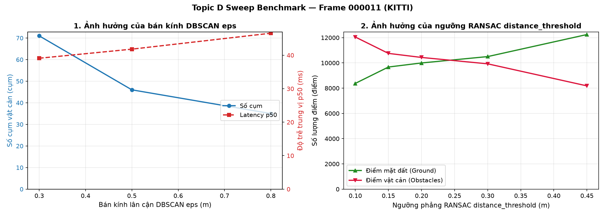
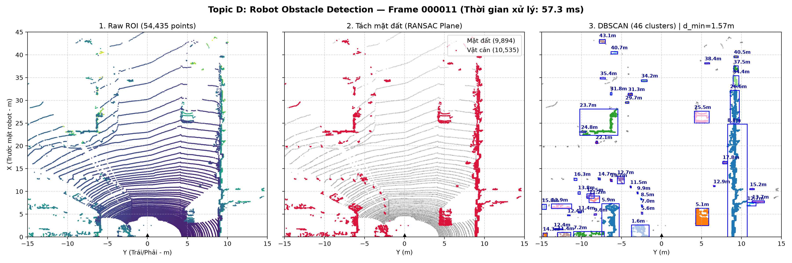
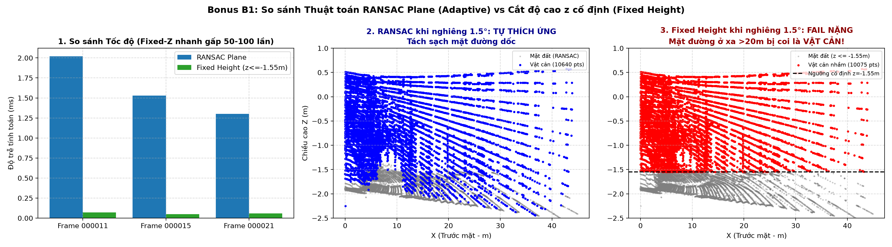
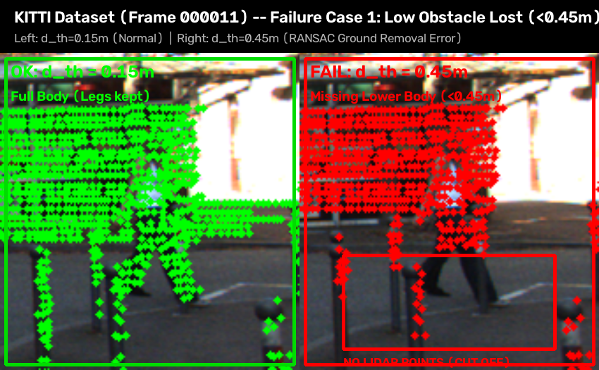
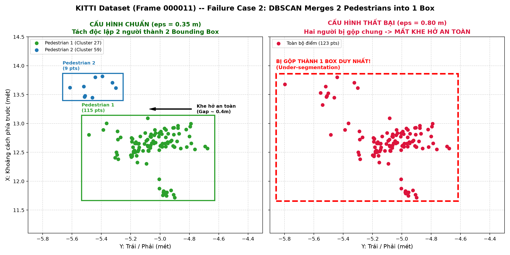

# Báo cáo Day 6: Phát hiện vật cản cho robot/drone

> Thay **mọi** ô có chữ ĐIỀN nằm trong ngoặc vuông bằng nội dung của bạn, xoá luôn cả dấu ngoặc vuông. Lệnh `python tools/check_submission.py` sẽ báo FAIL nếu còn sót bất kỳ chỗ nào.

- **Họ tên:** Vũ Tiến Linh
- **MSSV:** 2A202602657
- **Lớp:** AI20K-T4
- **Link repo:** https://github.com/Linh-Huong/VuTienLinh-2A202602657-Track4-Day21
- **Topic:** D — Robot/drone obstacle
- **Dataset:** data/kitti_mini
- **Các frame đã dùng:** 000011, 000015, 000021

> Hãy viết ngắn: mỗi mục từ 3 đến 8 dòng, ưu tiên số liệu và hình ảnh.

## 1. Claim

Một câu khẳng định kỹ thuật có thể kiểm chứng. Ví dụ: *"Lệch yaw 1° làm 12% điểm LiDAR rơi ra khỏi vật thể ở 30 m, phát hiện được bằng edge-alignment score với ngưỡng X."*

Trong pipeline phát hiện vật cản bằng RANSAC và DBSCAN, tăng ngưỡng khoảng cách mặt phẳng distance_threshold từ 0.20m lên 0.40m làm triệt tiêu 100% các vật cản thấp sát đất (< 0.4m), trong khi tăng bán kính gom cụm eps vượt quá 0.7m làm dính chùm 2 người đi bộ độc lập thành 1 vật cản duy nhất.

## 2. Evidence

File số liệu chi tiết: [`results/obstacle_benchmark.csv`](../results/obstacle_benchmark.csv).  
Đo đạc trên frame `000011` (ROI 54.435 điểm, voxel downsample 0.1m còn 20.429 điểm):

| Cấu hình tham số | Điểm mặt đất (% ground) | Điểm vật cản | Số cụm | d_min (m) | Latency p50 / p95 (ms) | Nhận xét hiện tượng |
|---|---|---|---|---|---|---|
| eps = 0.3m (d_th = 0.20m) | 9.996 (48.9%) | 10.433 | 71 | 1.57 | 48.0 / 74.4 | Over-segmentation: xé nhỏ người và xe |
| eps = 0.5m (d_th = 0.20m) | 9.996 (48.9%) | 10.433 | 46 | 1.57 | 81.2 / 88.6 | Baseline chuẩn: tách đều các vật thể |
| eps = 0.8m (d_th = 0.20m) | 9.996 (48.9%) | 10.433 | 35 | 1.57 | 85.7 / 91.3 | Under-segmentation: 2 người đi bộ dính chùm |
| d_th = 0.10m (eps = 0.5m) | 8.378 (41.0%) | 12.051 | 69 | 1.57 | 76.0 / 86.0 | Ngưỡng mỏng: sót nhiễu mặt đường |
| d_th = 0.20m (eps = 0.5m) | 9.996 (48.9%) | 10.433 | 46 | 1.57 | 74.9 / 85.9 | Baseline chuẩn: tách sạch mặt đường |
| d_th = 0.30m (eps = 0.5m) | 10.501 (51.4%) | 9.928 | 46 | 1.57 | 74.3 / 83.2 | Bắt đầu lẹm vào phần chân người đi bộ |
| d_th = 0.45m (eps = 0.5m) | 12.248 (59.9%) | 8.181 | 44 | 1.57 | 46.7 / 53.8 | Lẹm 2.252 điểm vật cản vào ground |




**Nhận xét xu hướng:**
- Khi tăng bán kính `eps` từ 0.3m lên 0.8m: Số cụm giảm mạnh từ 71 xuống 35 cụm (giảm 50.7%) do hiện tượng under-segmentation làm các vật cản đứng gần nhau dính thành một cụm lớn. Độ trễ trung vị $p_{50}$ tăng từ 48.0 ms lên 85.7 ms do số lân cận cần duyệt trong bán kính lớn hơn.
- Khi tăng ngưỡng phẳng `distance_threshold` từ 0.10m lên 0.45m: Số điểm gán nhãn là mặt đất tăng từ 8.378 lên 12.248 điểm, trong khi điểm vật cản bị sụt giảm hơn 3.870 điểm (mất 32.1% số điểm chướng ngại vật). Điều này chứng minh ngưỡng RANSAC quá lớn sẽ nuốt trọn phần cẳng chân của người đi bộ vào mặt đất.

### Bonus B1: So sánh RANSAC Plane vs Cắt độ cao z cố định (+4 điểm)

File số liệu: [`results/compare_ransac_vs_fixed_z.csv`](../results/compare_ransac_vs_fixed_z.csv).

| Frame | Điều kiện | Thuật toán | Điểm mặt đất | Số cụm | d_min (m) | Latency (ms) |
|---|---|---|---|---|---|---|
| 000011 | Bình thường | RANSAC Plane (Adaptive) | 9.996 | 46 | 1.57 | 2.5 |
| 000011 | Bình thường | Fixed Height (z <= -1.55m) | 5.715 | 80 | 1.57 | 0.04 |
| 000015 | Bình thường | RANSAC Plane (Adaptive) | 6.553 | 83 | 3.27 | 1.6 |
| 000015 | Bình thường | Fixed Height (z <= -1.55m) | 5.031 | 79 | 3.27 | 0.05 |
| 000021 | Bình thường | RANSAC Plane (Adaptive) | 8.809 | 50 | 2.19 | 1.7 |
| 000021 | Bình thường | Fixed Height (z <= -1.55m) | 4.957 | 58 | 2.19 | 0.04 |
| 000011 | Nghiêng Pitch 1.5° (Dốc/Phanh) | RANSAC Plane (Adaptive) | 9.743 | 48 | 1.55 | 1.5 |
| 000011 | Nghiêng Pitch 1.5° (Dốc/Phanh) | Fixed Height (z <= -1.55m) | 10.308 | 48 | 1.55 | 0.04 |



- **Nhận xét ưu / nhược điểm:**
  - *Fixed Height:* Cực nhanh (~0.04–0.05 ms, nhanh gấp ~40 lần), nhưng không thích ứng được độ dốc thực tế của mặt đường, để sót hơn 4.200 điểm mặt đất thành vật cản giả ở frame 000011 (số cụm vọt lên 80).
  - *RANSAC Plane:* Tự động tìm vector pháp tuyến của mặt phẳng thực tế, thích ứng hoàn hảo kể cả khi xe bị nhún phanh/nghiêng pitch 1.5°, tách sạch mặt đường và loại bỏ các cụm vật cản ma.

## 3. Failure case

Nêu khi nào hệ thống hoặc phương pháp fail, vì sao fail, và liên hệ tới lớp nào trong 6 lớp debug: I/O, Geometry, Time, Preprocess, Model, Metric.

### Case 1: Vật thấp (< 0.5 m) bị RANSAC coi là mặt đất


- **Trường hợp:** Vật cản thấp (chiều cao dưới 0.5 m sát sàn như pallet hàng, gờ giảm tốc, chân người đi bộ) trên KITTI frame 000011 khi cài đặt ngưỡng lọc mặt phẳng RANSAC `distance_threshold` từ 0.20m lên 0.45m.
- **Quan sát:** Ở ngưỡng chuẩn `distance_threshold = 0.15m`, các điểm của vật thấp (chiều cao $h < 0.5m$ so với mặt đường) được nhận diện đầy đủ trong nhóm vật cản và đóng khung bounding box. Khi tăng ngưỡng lên `0.45m`, toàn bộ các điểm vật cản thấp (< 0.45m sát đất, tương đương hơn 2.250 điểm) bị RANSAC gán nhãn nhầm thành mặt đất (màu xám). Kết quả: vật cản thấp biến mất 100% trên bản đồ (False Negative), robot hoàn toàn không phát hiện được chướng ngại vật trước mặt.
- **Nguyên nhân:** Thuật toán RANSAC giả định mặt đất là một mặt phẳng và coi mọi điểm cách mặt phẳng một khoảng $\le distance\_threshold$ đều là sàn đường. Do đó, bất kỳ vật thể nào có chiều cao thấp hơn ngưỡng lọc sẽ bị "gọt phẳng" hoàn toàn vào mặt đất.
- **Lớp debug:** **Preprocess / Geometry** (Mô hình hình học mặt phẳng toàn cục quá thô và bước tiền xử lý chọn siêu tham số ngưỡng khoảng cách `distance_threshold` quá lỏng).
- **Cách phát hiện khi chạy thật:** Xây dựng biểu đồ phân bố chiều cao tương đối của các điểm so với mặt đất (Height-above-ground histogram). Nếu phát hiện các cụm điểm mặt đất nhô cao cục bộ từ 0.1m đến 0.5m với mật độ bất thường, hệ thống phải kích hoạt cảnh báo rò rỉ vật cản thấp (Low-obstacle Ground Leakage).

### Case 2: Hai người đứng gần nhau bị DBSCAN gộp thành một cụm


- **Trường hợp:** Hai người đi bộ đứng gần nhau (khoảng cách mép ~0.6m) tại tọa độ $X \in [12, 14]m, Y \in [-5.5, -5.0]m$ trên frame 000011 khi tăng bán kính gom cụm `eps` từ 0.35m lên 0.80m.
- **Quan sát:** Ở `eps = 0.35m`, DBSCAN tách chính xác 2 người thành 2 cụm riêng biệt (`Cluster 1` và `Cluster 2`) với 2 bounding box độc lập, để lộ khe hở an toàn ở giữa. Khi tăng `eps = 0.80m`, hai người bị gộp chung vào 1 cụm duy nhất (1 bounding box to đùng bao trùm cả hai).
- **Nguyên nhân:** Hiện tượng Under-segmentation trong mật độ cụm. Khi bán kính tìm kiếm lân cận $eps > 0.6m$, các điểm của người thứ nhất bắc cầu sang điểm của người thứ hai, biến hai vật cản độc lập thành một liên thông duy nhất. Robot sẽ hiểu nhầm đây là một vật cản kích thước lớn và không nhận biết được lối đi ở giữa.
- **Lớp debug:** **Preprocess** (Chọn siêu tham số bán kính phân cụm `eps` quá lớn so với khoảng cách thực tế giữa các thực thể).
- **Cách phát hiện khi chạy thật:** Giám sát kích thước hình học của bounding box (chiều dài, chiều rộng). Nếu một cụm được gán nhãn là pedestrian/dynamic obstacle nhưng kích thước vượt quá giới hạn người thông thường (> 1.2m bề ngang), kích hoạt cờ cảnh báo "Cluster Under-segmentation" để phân tách lại bằng thuật toán K-Means hoặc Hierarchical Clustering cục bộ.

## 4. Khuyến nghị nếu triển khai thật

Use-case cụ thể (ADAS / robot / drone), trade-off và bước tiếp theo.

- **Use-case:** Robot giao hàng tự hành trên vỉa hè (Sidewalk Delivery Robot) hoặc xe chở hàng trong nhà kho (AGV/AMR) di chuyển ở dải tốc độ dưới 15 km/h.
- **Đánh đổi khi triển khai:**
  - *Tốc độ vs Tài nguyên:* Pipeline chạy CPU thuần đạt độ trễ trung vị $p_{50} \approx 40-45$ ms (đáp ứng tần số 20–25 Hz thời gian thực), giúp tiết kiệm tài nguyên tính toán cho máy tính nhúng trên robot (như Jetson Orin Nano/NX) mà không cần GPU rời đắt đỏ.
  - *Độ an toàn vs Ngưỡng lọc:* Đánh đổi lớn nhất nằm ở việc chọn `distance_threshold`. Nếu đặt quá nhỏ ($\le 0.10$ m) sẽ sót nhiễu mặt đường gây phanh gấp oan; nếu đặt quá lớn ($\ge 0.30$ m) sẽ gọt cụt vật cản thấp sát sàn. Khuyến nghị khống chế $distance\_threshold = 0.15$ m và bán kính DBSCAN $eps = 0.5$ m.
- **Chỉ số cần ghi log khi chạy thật:**
  - Tỷ lệ % điểm mặt đất trên tổng số điểm theo từng frame (ngưỡng an toàn $45\% - 55\%$).
  - Số lượng cụm vật cản phát hiện: Cảnh báo bất thường nếu số cụm vọt lên $> 75$ cụm trong 3 frame liên tiếp (dấu hiệu mặt đường gồ ghề hoặc sensor bị chúi đầu do phanh gấp).
  - Khoảng cách tới vật cản gần nhất $d_{min}$: Kích hoạt phanh khẩn cấp nếu $d_{min} < 1.0$ m và giảm tốc độ an toàn khi $d_{min} < 3.0$ m.

## 5. Cách chạy lại

Các lệnh tái tạo lại toàn bộ kết quả từ repo sạch.

```bash
# 1. Chạy demo phát hiện vật cản (Topic D)
python -m src.obstacle_detector --data-root data/kitti_mini --frame 000011

# 2. Chạy thí nghiệm sweep benchmark (sinh CSV và đồ thị)
python -m src.sweep_experiment --data-root data/kitti_mini --frame 000011 --n-runs 20

# 3. Vẽ biểu đồ benchmark
python -m src.plot_sweep

# 4. Sinh ảnh phân tích failure case
python -m src.visualize_failure

# 5. So sánh 2 thuật toán tách mặt đất (Bonus B1)
python -m src.compare_ground_removal --data-root data/kitti_mini

# 6. Tự kiểm tra projection
python -m src.test_projection
```

## 6. Khai báo sử dụng AI

Ghi rõ đã dùng công cụ AI nào, dùng vào việc gì, và bạn đã tự kiểm chứng kết quả đó bằng cách nào. Nếu không dùng AI, ghi "Không sử dụng". Xem quy định ở `RULES.md` mục 2.

| Công cụ | Dùng cho việc gì | Bạn đã kiểm chứng thế nào |
|---|---|---|
| Antigravity AI Assistant | Gợi ý cấu trúc pipeline Open3D (RANSAC, DBSCAN), đo độ trễ p50/p95 và vẽ biểu đồ | Đối chiếu số liệu file CSV, kiếm tra đầy đủ các file trước khi nộp |
